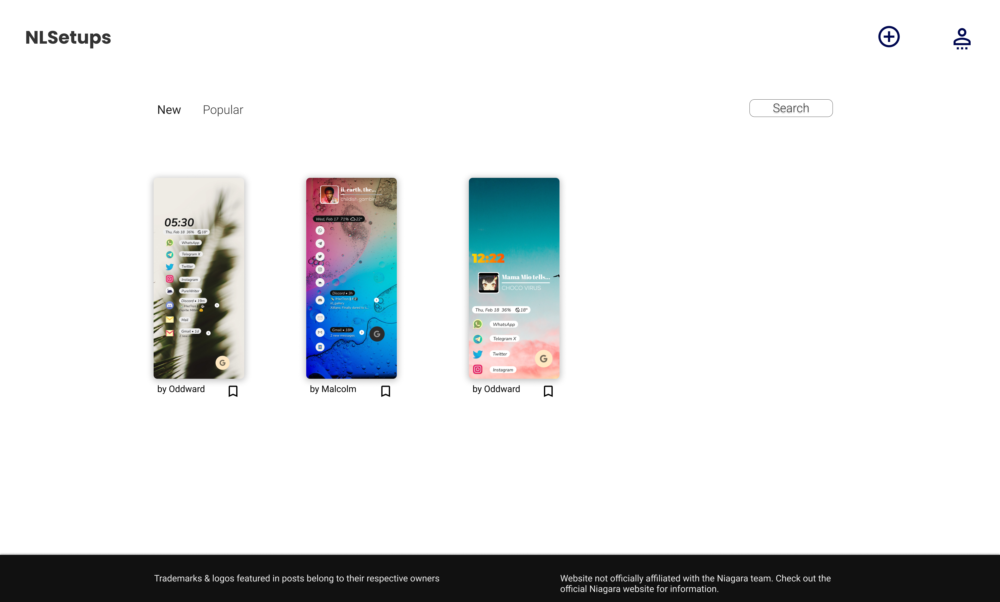
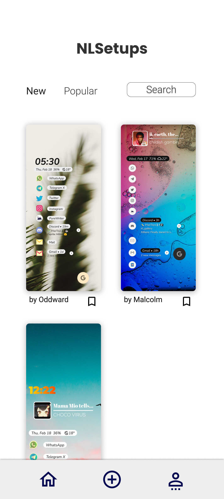

# Dev Notes

Notes to reference to aid the design & development of the app

## Data structures

Overview of data models that'll probably be used (sub objects may be separate model)
- may use APIs for data, if not local files

### Tables

--- Users ---

| id | name | username | avatar_id | created_date | closed_date |
|:----:|:----:|:----:|:----:|:----:|:----:|
| str | str | str | str | datetime | datetime |

--- <strong style="font-weight: 900;">Follows</strong> ---

| follower_id | following_id | follow_date |
|:----:|:----:|:----:|
| str | str | datetime |

--- Files ---

| id | filename | MIME_type  | file_address | category | uploaded_date |
|:----:|:----:|:----:|:----:|:----:|:---:|
| str | str | str | str | str | datetime |

--- Posts ---

| id | user_id | image_id | description | tags | created_date |
|:----:|:----:|:----:|:----:|:----:|:----:|
| str | str | str | str | str | datetime |

--- Comments ---

| id | user_id | post_id | reply_to_id | created_date |
|:----:|:----:|:----:|:----:|:-:|
| str | str | str | str | datetime |

_plus **deleted_date** for most_

## UI/UX design

- minimal UI with generous negative space
- post images focused
- few UI interactions (like, bookmark, follow)

## UI structure

High level component hierarchy/composition (based on mockups)

_--- Mockups of Feed when widescreen & when narrow/mobile/snapped to the side_

_--- Post - scrolled with comments_

_--- User profile - header & post tabs_

### Component structure

- App
	- Titlebar/app header
		- title (& brand)
		- submit new
		- profile
	- Main-view
		- feed/post/profile/about
	- Footer
		- info
...

## State

Global:
- current track (id/filename?)
- current playlist --- Now Playing
- playing/paused
- logged into streaming service ( ? )
- view (Now Playing | Browser)

## Web technologies

- react
- tailwindcss with styled components ( ? )
- redux ( ? )
